# Rotina de PM com IA

30/09/2026

## Visão geral

Este sistema devolve ao PM o controle do dia sem reduzir as reuniões das 9h às 18h: a IA coleta, organiza e rascunha, e o PM decide. Ele nasceu de três problemas: agenda cheia com fadiga mental, pouco tempo para trabalho de foco e estudo, e cobrança constante por artefatos (status, PPTs, roadmap, OKRs, métricas, histórias, comunicação).

**Princípios**

- **A IA rascunha, você decide.** Nada sai para outras pessoas sem sua aprovação: comunicados, semáforo do status, histórias, PRDs, OKRs, roadmap e princípios.
- **O vault do Obsidian é a fonte única.** Tudo o que é capturado no dia vira matéria-prima dos artefatos. Nenhum artefato começa do zero.
- **Motor e contexto separados.** Comandos, templates e convenções são genéricos. O que é de um tema (MCP hoje, outro amanhã) fica na pasta do tema.
- **Extração, não resumo.** A IA lista tudo com fonte e horário, e suas palavras-chave e desenhos servem de âncora para conferir.
- **Números só da fonte.** Métricas e datas nunca são estimadas pela IA.
- **Conteúdo corporativo fica no seu ambiente.** O kit é genérico; template de PPT, regras de pontuação das histórias e histórico são processados localmente pelo Claude Code.
- **Proteger a energia.** Arranque e fechamento são os únicos hábitos obrigatórios. Todo o resto é sob demanda.

## Papel de cada ferramenta

Cada ferramenta tem uma função e não disputa espaço com as outras.

| Ferramenta | Função | O que faz na rotina |
| --- | --- | --- |
| Copilot M365 | Coleta | Lista reuniões, extrai decisões e pendências das transcrições, acha documentos, coleta respostas ao comunicado |
| Obsidian | Guarda | Nota diária, pastas por tema, fila de revisão, histórico pesquisável |
| Excalidraw (no Obsidian) | Desenha | Caixogramas vivos e rascunhos de reunião, com marcadores que a IA lê |
| Claude Code | Processa | Roda os comandos sobre o vault: fechamento, status, PRD, histórias, PPT, comunicado, importação |
| FigJam | Visualiza | Jornadas, blueprints, dinâmicas (visioning, naming), esboços de dashboard |
| Power Automate + Teams | Dispara | Comunicado semanal com aprovação, em chat individual e no canal do produto |
| Devin e GitHub Copilot | Código | Protótipos e tarefas técnicas, fora da rotina |

Quando o MCP da ferramenta de backlog estiver pronto, ele entra como mais uma fonte do Claude Code e substitui os prints do board.

## Arquitetura

O sistema separa o motor (igual para todos) do contexto (uma pasta por tema), e dentro do tema separa fontes de visões.

```mermaid
flowchart LR
    subgraph C[Captura · durante o dia]
        c1[Reuniões - Copilot]
        c2[Nota diária]
        c3[Desenhos - Excalidraw]
        c4[Prints do board]
        c5[Entrevistas]
        c6[Histórico importado]
    end
    subgraph F[Fontes do tema · uma pasta por tema]
        f1[Contexto e glossário]
        f2[Decisões e princípios]
        f3[Evidências de usuários]
        f4[Caixogramas]
        f5[Roadmap mensal]
        f6[OKRs]
        f7[Métricas]
        f8[Entregas]
    end
    subgraph V[Visões · geradas pelos comandos]
        v1[Status report]
        v2[Demo e PPTs]
        v3[PRD e histórias]
        v4[Comunicado semanal]
        v5[Jornadas e blueprints]
        v6[Specs de dashboard]
    end
    C --> F --> V
    M[Motor: comandos, templates, convenções e prompts, iguais para qualquer tema e PM]
```



Os comandos diários e o `/importar` alimentam as fontes; os comandos de artefato leem as fontes e geram as visões. Por isso o roadmap do slide é o mesmo do status e do comunicado.

**Estrutura do vault**

```text
vault/
  00-Inbox/_entrada/     material para /importar e prints do board
  01-Diario/             notas diárias
  02-Temas/
    MCP/
      _contexto.md       objetivo, gatilhos, glossário, stakeholders
      Roadmap.md  OKRs/  Metricas/  Entregas/
      Evidencias/  Principios/  Diagramas/  Historico/
      PRDs/  Historias/  Artefatos/
    _modelo-tema/        copiado pelo /novo-tema
  03-Backlog/Retratos/   retrato diário do board
  04-Comunicacao/        comunicados, exemplos, card, Power Automate
  90-Config/             config pessoal, convenções, prompts, rubrica, template
  99-Templates/          nota diária e seção de reunião
  A revisar.md           fila de revisão
  CLAUDE.md              regras que o Claude Code segue no vault
  .claude/skills/        os 21 comandos
```

Ao mudar de tema, a pasta antiga vai para o arquivo e continua pesquisável. Com mais de um tema ativo, a nota diária continua única e cada reunião leva a etiqueta do seu tema.

## A rotina

A rotina se apoia em três pontos que você controla: o começo do dia, o fim do dia e as manhãs antes das 9h. Arranque e fechamento são obrigatórios; o resto é sob demanda.

**Todo dia útil**

| Horário | O que fazer | Ferramentas |
| --- | --- | --- |
| 8h40–9h | Arranque: prompt da lista de reuniões no Copilot, `/abrir-dia`, até 3 prioridades. Print do board e `/daily` antes da daily | Copilot, Claude Code |
| 9h–18h | Reuniões em modo radar: palavras-chave na nota, desenhos dentro da seção da reunião, micropausas de 3 a 5 min, almoço protegido. Reunião não prevista: atalho do Templater | Obsidian, Excalidraw |
| 18h–18h20 | Fechamento: extração e segunda passada no Copilot, `/fechar-dia`, três perguntas de reflexão, nota de energia, até 3 itens para revisar | Copilot, Claude Code |
| Depois de 18h20 | Desligar. Nada de trabalho ou estudo à noite | |

**Toda semana**

| Quando | O que fazer |
| --- | --- |
| Segunda | Prompt de coleta das respostas ao comunicado; olhada de 15 min na semana |
| Terça e quinta | 20 min de estudo leve |
| Véspera do refino | `/historias` e `/refino` |
| Sexta 7h–8h15 | Estudo profundo |
| Sexta 8h15–9h | `/semana` (inclui check-in dos OKRs), `/status` (você define o semáforo), um `/principio`, `/comunicado` e aprovação do disparo |

**Todo mês**

- Semana da demo: `/metricas relatorio` com os prints ou exports dos dashboards, depois `/demo` (registro de entregas + PPT + roteiro).
- Depois da demo: `/roadmap rolar`, que empurra o roadmap uma coluna e registra o que mudou e por quê. A demo também gera uma edição especial do comunicado.

**Todo trimestre**

- Início: `/okr` para escrever os OKRs, `/roadmap` para os três ciclos mensais, `/metricas definir` para o que medir.
- Fim: fechamento dos OKRs a partir dos check-ins semanais.

**Sob demanda**

`/prd`, `/historias`, `/entrevista`, `/figjam`, `/importar`, `/novo-tema`.

## Reuniões

Cada reunião ganha uma seção na nota diária com duas etiquetas, tema (`#tema/mcp`) e tipo, e o tipo define de onde vem o registro.

| Tipo | Exemplos | Fonte do registro | O que o fechamento faz |
| --- | --- | --- | --- |
| Gravada | Decisão, alinhamento, stakeholders | Extração do Copilot + suas palavras-chave | Confere as palavras-chave na extração e sinaliza lacunas |
| Ritual do time | Daily (agora transcrita), refino (transcrição automática no convite) | Extração + print do board | Registra compromissos, bloqueios e mudanças no backlog |
| Não gravada | Retro, conversas informais | Desenho + suas 2 ou 3 linhas | Cobra as linhas e usa o desenho como fonte principal |
| Entrevista | Usuários, descoberta | Transcrição ou notas | Encaminha para `/entrevista` |

**Reuniões que surgem no meio do dia**

- **No fechamento, automaticamente:** a extração lista todas as reuniões de que você participou. Reunião sem seção ganha uma, marcada `#reuniao/surgiu-no-dia`. Reunião que não aconteceu vira `#reuniao/cancelada`.
- **Durante o dia:** o atalho do Templater insere uma seção com o horário atual. Você escreve o título e cria o desenho ali dentro.
- **Chamadas avulsas sem transcrição:** uma linha na nota ("call com fulano sobre X") com os marcadores de sempre.

O `/semana` conta reuniões planejadas, surgidas e canceladas e cruza com a nota de energia. É o dado para conversar sobre agenda com o gestor.

**Daily e refino**

- Você continua presente na daily. O `/daily` usa o print do board, o retrato do dia anterior e os compromissos da daily anterior para apontar itens parados, bloqueios sem dono e promessas não cumpridas. Conduzir em cima de fatos encurta a daily.
- No refino, `/historias` e `/refino` preparam histórias, perguntas em aberto e a pauta. O time chega discutindo, não escrevendo do zero.
- Avise o time antes de começar a transcrever a daily.

## Desenhos e caixogramas

Como os desenhos são feitos com caixas de texto, o Claude Code lê o conteúdo e as conexões com precisão, sem interpretar imagem.

**Marcadores no início de uma caixa de texto**

| Marcador | Significa | Exemplo |
| --- | --- | --- |
| `D:` | Decisão | `D: todo server novo passa pelo gateway` |
| `?` | Dúvida ou algo a confirmar | `? quem aprova servers externos` |
| `!` | Risco de governança | `! server X acessa dado sensível sem auth` |
| `→` | Ação com responsável | `→ Ana: revisar escopo OAuth` |

O kit acrescenta `N:` para necessidade de usuário, que vai direto para o repositório de evidências. O que não tiver marcador também é lido, só com menos certeza.

**Dois tipos de desenho**

- **Rascunho de reunião:** nasce dentro da seção da reunião (comando do Excalidraw que cria o desenho já incorporado na nota ativa). A associação é explícita. Não crie desenhos vazios de manhã.
- **Diagrama vivo (caixograma):** um arquivo por sistema, em `02-Temas/<tema>/Diagramas/`. A nota do dia só aponta para ele quando você o altera. Frames com data mostram o que entrou quando.

**O que a IA faz com os caixogramas**

- Descreve o diagrama em texto ou gera uma versão Mermaid/C4 para PRDs.
- Mostra o que mudou entre versões, se o vault estiver versionado com o plugin Obsidian Git.
- Revisa o diagrama contra os princípios de governança do tema e aponta violações como requisitos, sem decidir a implementação.

**Configuração do Excalidraw**

- Desligue a compressão do JSON no markdown, para que setas e conexões fiquem legíveis.
- Exportação automática em PNG é opcional; vale se um dia você desenhar à mão livre ou se a posição no desenho carregar significado.
- Desenhos antigos comprimidos são descomprimidos pelo `/importar`.

## O que revisar

Tudo o que a IA gera nasce com `status: rascunho`, e a nota fixa **A revisar** lista automaticamente o que está pendente (plugin Dataview). Itens pontuais dentro de notas viram tarefas com a etiqueta `#revisar`.

| Nível | O que entra | Por quê |
| --- | --- | --- |
| Sempre revisar | Comunicado, semáforo do status, histórias, PRD, OKRs, roadmap, princípios, PPTs | Sai de você para outras pessoas ou vira compromisso |
| Só o sinalizado | Extrações diárias, importação do histórico, relatório de métricas | Os comandos marcam baixa confiança, conflito entre fontes, decisão que contradiz uma anterior e trecho possivelmente sensível |
| Não precisa | Índices, retratos do board, resumos de documentos importados | Consulta, não compromisso |

O `/fechar-dia` termina com no máximo três itens para revisar hoje. O resto fica na fila, e o `/semana` mostra o que está acumulando. Quando você aprova, o status muda para `validado`.

## Catálogo de comandos

São 21 comandos do Claude Code, todos genéricos: o que é específico vem do contexto do tema e da pasta de configuração.

| Comando | Quando | Lê | Entrega | Revisão |
| --- | --- | --- | --- | --- |
| `/abrir-dia` | 8h40 | Lista de reuniões do Copilot, contextos dos temas | Nota diária com seções por reunião + prompt de extração do dia com os gatilhos atuais | Não precisa |
| `/daily` | Antes da daily | Print do board, retrato anterior, extração da daily anterior | Itens parados, bloqueios sem dono, compromissos pendentes | Não precisa |
| `/fechar-dia` | 18h | Extração do Copilot, nota, desenhos do dia | Pendências, follow-ups, decisões, necessidades, seções de reuniões surgidas, 3 itens a revisar | Só o sinalizado |
| `/semana` | Sexta | Notas da semana, OKRs | Padrões de energia e agenda, decisões, pendências, check-in de OKRs, temas de estudo | Não precisa |
| `/status` | Sexta | Semana, roadmap, OKRs, métricas | Status report por público, em markdown e PPT | Sempre |
| `/principio` | Sexta | Decisões recorrentes | Princípio de governança no formato padrão | Sempre |
| `/comunicado` | Sexta | Entregas, decisões, evidências, exemplos de tom | JSON dos cards por segmento para o Power Automate | Sempre |
| `/prd` | Sob demanda | Notas, caixogramas, evidências, template de PRD | PRD com seção "perguntas para o tech lead" | Sempre |
| `/historias` | Antes do refino | PRD, caixogramas, rubrica | Épico, histórias, critérios de aceite, nota estimada | Sempre |
| `/refino` | Véspera do refino | Histórias, print do board | Pauta, perguntas em aberto, ordem de discussão | Não precisa |
| `/roadmap` | Trimestre e pós-demo | Roadmap, OKRs, evidências | Roadmap mensal, rolagem, visões (slide, FigJam) | Sempre |
| `/okr` | Trimestre | Contexto, métricas | OKRs revisados quanto à qualidade | Sempre |
| `/metricas` | Trimestre e mês | OKRs, dicionário, prints ou exports | Definição, spec de dashboard, relatório | Sempre |
| `/demo` | Mensal | Notas do mês, board, PRDs, métricas | Registro de entregas, PPT, roteiro | Sempre |
| `/ppt` | Sob demanda | Qualquer nota do vault | Apresentação no template da empresa | Sempre |
| `/entrevista` | Após entrevista | Transcrição ou notas | Necessidades atômicas com evidência | Só o sinalizado |
| `/figjam` | Sob demanda | Evidências, caixogramas, contexto | Prompt para a IA do FigJam ou diagrama via conector | Não precisa |
| `/novo-tema` | Ao assumir um tema | Entrevista com você, histórico | Pasta do tema com contexto preenchido | Sempre |
| `/importar` | Largada e contínuo | Pasta de entrada | Histórico estruturado, decisões, princípios candidatos | Só o sinalizado |
| `/configurar-template` | Uma vez | Arquivo de apresentação no vault | Mapa de layouts para os PPTs | Não precisa |
| `/configurar-rubrica` | Uma vez | Regras de pontuação e exemplos | Rubrica usada pelo `/historias` | Sempre |

Os prompts do Copilot ficam em `90-Config/prompts-copilot/` e também em [Prompts do Copilot.md](Prompts%20do%20Copilot.md): lista de reuniões, extração com segunda passada, daily, revisão de documento, respostas ao comunicado e importação. Todos começam com uma checagem de completude ("quantas reuniões você encontrou?").

## Roadmap mensal, OKRs e métricas

O roadmap anda em ciclos mensais alinhados à demo, e os OKRs do trimestre funcionam como bússola. No Q4, os três ciclos são outubro, novembro e dezembro.

**Horizontes do roadmap**

| Horizonte | Compromisso | Como descrever |
| --- | --- | --- |
| Mês atual | Compromisso: o que aparece na demo | Entregas concretas |
| Próximo mês | Planejado, alta confiança | Entregas, ainda ajustáveis |
| Daqui a dois meses | Direção | Problemas a resolver, não funcionalidades |
| Longo prazo | Apostas | Temas e resultados buscados, sem data |

Cada iniciativa tem horizonte, OKR ligado, evidência e status. Depois de cada demo, `/roadmap rolar` empurra tudo uma coluna e registra o motivo de cada mudança. Do mesmo arquivo saem o slide, a timeline no FigJam, a seção do status e o "o que vem a seguir" do comunicado.

**OKRs**

- Um arquivo por tema e trimestre: objetivos e KRs com baseline, meta, fonte da métrica e dono.
- O `/okr` aponta KR que é entrega disfarçada ("lançar X") ou que não é mensurável.
- O `/semana` faz check-in com seu nível de confiança em cada KR; no fim do trimestre, os check-ins viram o fechamento.

**Métricas em três momentos**

1. **Definir** (`/metricas definir`): parte dos OKRs e do contexto e propõe uma métrica principal e as que a movem. Exemplos para uma plataforma de MCP: servers publicados, consumidores ativos, servers com autorização adequada, tempo de aprovação, incidentes, tempo até o primeiro uso.
2. **Orientar o time de dados** (`/metricas dashboard`): dicionário (definição, fórmula, fonte, granularidade, segmentos, meta) e especificação de cada dashboard (pergunta de negócio, público, visualizações, filtros, frequência), com esboço no FigJam. O time de dados decide o "como".
3. **Relatar** (`/metricas relatorio`): a partir de prints ou exports, analisa tendência, compara com a meta, aponta anomalias e sugere hipóteses. Números só da fonte.

## Comunicação semanal

A IA escreve, você aprova e o Power Automate dispara o mesmo card de newsletter no chat individual (como você faz hoje) e no canal do produto.

1. **Rascunho:** o `/comunicado` monta a edição a partir de entregas, decisões, dicas e casos reais, no seu tom (exemplos em `04-Comunicacao/Exemplos/`). Gera um JSON com um card por segmento (geral, consome, publica, segurança) e salva na pasta sincronizada do OneDrive.
2. **Gatilho:** o fluxo dispara quando o arquivo aparece na pasta.
3. **Aprovação:** o fluxo te envia a prévia do card e uma aprovação no Teams.
4. **Disparo:** aprovado, percorre a lista do SharePoint (segmento e opt-out), envia o card do segmento de cada pessoa com um intervalo entre envios, e publica a versão geral no canal.
5. **Coleta:** na segunda, um prompt do Copilot junta as respostas recebidas no chat e as joga no repositório de evidências.

**Estrutura do card:** linha pessoal no topo, destaque da semana, dica, caso real, próximos passos e botões para o post do canal, documentação e feedback (Forms).

**Cuidados:** respeite o opt-out; dispare num horário em que você consiga responder (sexta de manhã); nunca envie texto gerado sem aprovação. O passo a passo do fluxo e o template do card estão no kit, em `04-Comunicacao/Power-Automate/`.

## Importação do histórico

O `/importar` transforma o histórico do tema em material de trabalho: linha do tempo, decisões, princípios candidatos, evidências e contexto preenchido. Tudo roda no seu computador; nada passa por fora do seu ambiente.

**O que colocar na pasta `00-Inbox/_entrada/`**

| Fonte | Como obter | Observação |
| --- | --- | --- |
| Transcrições de reuniões que você organizou | Download direto no Teams | Gravações e transcrições têm prazo de retenção; as antigas podem ter sumido |
| Demais reuniões | Prompt de extração histórica do Copilot, mês a mês | Salve cada mês como um arquivo |
| Desenhos do Excalidraw | Já estão no vault | O comando descomprime e classifica |
| Apresentações, documentos, PDFs | Download do OneDrive/SharePoint (o Copilot ajuda a achar) | O original continua sendo a referência; o vault guarda markdown, resumo e link |

**O que sai**

- `Historico/linha-do-tempo.md`: marcos e decisões com data e fonte.
- `Historico/decisoes.md`: log retroativo; quando uma decisão mudou, fica a atual e o histórico do porquê.
- `Principios/`: princípios candidatos, em rascunho, para você validar.
- `Evidencias/`: necessidades de usuários que apareceram ao longo do tempo.
- `_contexto.md`: glossário, stakeholders, sistemas e pendências históricas preenchidos.

**Prioridade:** últimos 3 a 6 meses e documentos-chave (arquitetura, PRDs, apresentações para liderança) antes de segunda. O resto entra aos poucos; o Claude Code processa lotes grandes sozinho.

**Fora da importação:** 1:1s, assuntos de pessoas e dados pessoais. O comando sinaliza trechos que parecem sensíveis antes de salvar e registra o que já foi processado, então pode ser rodado várias vezes sem duplicar.

## Semana de largada

O sistema entra inteiro na segunda, 5 de outubro, início do Q4. Até lá, instalação, calibração e importação mínima.

Instalação detalhada, passo a passo: [Setup passo a passo.md](Setup%20passo%20a%20passo.md)

**Quarta, 30/9, e quinta, 1/10: instalar e calibrar**

- [ ] Confirmar com a empresa os pontos da seção seguinte
- [ ] Copiar o conteúdo de `vault-modelo/` para o vault e instalar os plugins (Templater, Dataview, Excalidraw; Obsidian Git opcional)
- [ ] Ajustar o Excalidraw (compressão desligada) e preencher `90-Config/config.md`
- [ ] Colocar o template de apresentação em `90-Config/ppt/` e rodar `/configurar-template`
- [ ] Salvar as regras de pontuação das histórias em `90-Config/rubrica-fontes/` e rodar `/configurar-rubrica`
- [ ] Salvar 2 ou 3 comunicados antigos em `04-Comunicacao/Exemplos/`
- [ ] Baixar transcrições e documentos-chave dos últimos 3 a 6 meses e rodar `/importar`
- [ ] Montar o fluxo do Power Automate (pode ficar para a semana seguinte)

**Sexta, 2/10: planejar o Q4**

- [ ] `/novo-tema MCP` para revisar o contexto que a importação preencheu
- [ ] `/okr` para os OKRs do Q4
- [ ] `/roadmap` com outubro, novembro, dezembro e longo prazo
- [ ] `/metricas definir`
- [ ] Validar os princípios candidatos mais importantes
- [ ] Avisar o time sobre a transcrição da daily e ativar a transcrição automática no convite do refino

**Segunda, 5/10: rotina completa**

- [ ] Arranque às 8h40 e fechamento às 18h
- [ ] Primeira `/daily` com print do board

Se alguma semana apertar, priorize arranque e fechamento. São os únicos hábitos que precisam ser construídos; o resto é sob demanda.

## Pontos a confirmar e como compartilhar

**Confirmar na empresa antes de usar**

- [ ] Uso do Claude Code sobre o vault com conteúdo corporativo
- [ ] Manter cópias de transcrições e documentos no vault (e onde o vault fica: computador corporativo ou OneDrive da empresa)
- [ ] Transcrição da daily e transcrição automática do refino, com ciência do time
- [ ] Conector do Figma no Claude Code, se quiser gerar diagramas direto no FigJam
- [ ] Disparo em massa de cards pelo Power Automate e uso de lista com opt-out

**Compartilhar com outros PMs**

- **O que vai no pacote:** o motor (comandos, templates, convenções, prompts do Copilot, template de card e guia). Pode virar um plugin do Claude Code num repositório interno, para que melhorias cheguem a todos.
- **O que nunca vai:** notas, temas, desenhos, transcrições, rubrica e template calibrados. Cada PM calibra com `/configurar-template` e `/configurar-rubrica`.
- **Cada peça é opcional:** quem não usa Excalidraw ou tem outra ferramenta de backlog ajusta `90-Config/config.md` sem mexer nos comandos.
- **Convenções comuns:** com os mesmos marcadores de desenho, um PM lê o caixograma do outro, e a IA cruza temas.
